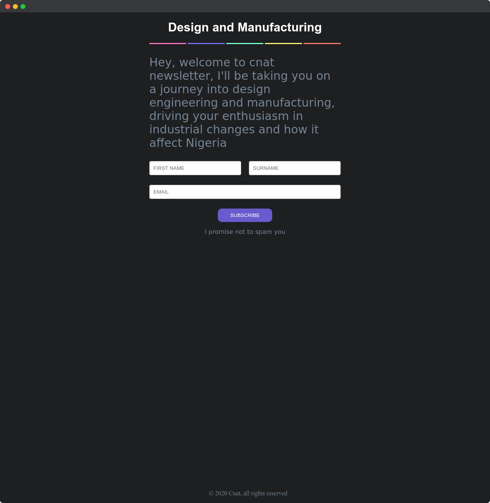

# Newsletter

> Inspired by the latest trend in industry 4.0

Follow me on a journey and learn with me as I explore new technologies. This is a curated set of weekly mails particular in design engineering which may also include frontend web development.

The goal is to build community-driven articles for subscribers to consume, grow and be a part of.

Shares, sponsorships and suggestions are always welcome ❤.

## Tech Stack

This is a simple landing page. Vanilla technologies will do just fine.

## Contributing

I am super exicted for all your contributions. All you have to do is

- `Fork` this repo
- Create a new `branch`
- Make changes
- Submit `Pull Request`

## Subscribe To Newsletter

## Connect

